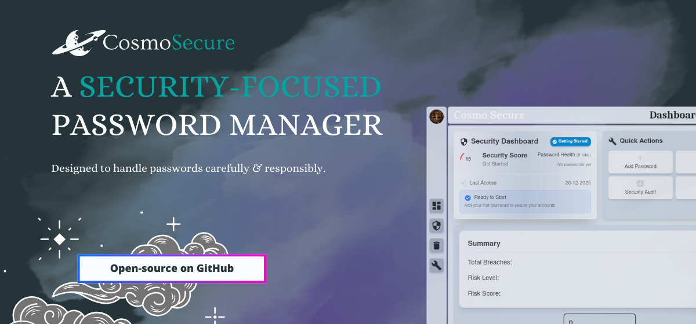

<!-- 

-->


# CosmoSecure

CosmoSecure is an open-source, cross-platform password manager implementing **Zero-Knowledge Proof (ZKP) architecture** with **client-side encryption**. Built with Rust, Tauri, and React, it ensures the server never knows your master password through encrypted canary verification, providing genuine zero-knowledge security with complete user control over sensitive data.

---

## Application Goals

CosmoSecure addresses a fundamental question:

**How can a secure desktop password manager be built with client-side encryption and complete user control over sensitive data?**

The application aims to:

- Implement **Zero-Knowledge Proof** architecture where the server cannot verify master passwords
- Provide client-side encryption with encrypted canary verification
- Maintain complete user control over master passwords through ZKP authentication
- Offer transparent, auditable security implementations
- Balance robust cryptographic security with intuitive user experience
- Currently supports cloud storage with local storage planned for future releases

---

## Features

- **Zero-Knowledge Proof (ZKP) Authentication**: Server stores only encrypted canary values, never password hashes - authentication happens entirely client-side
- **Client-Side Verification**: Master password correctness verified by decrypting an encrypted canary string locally
- **Secure Password Vault**: AES-256-GCM encryption for all password data with PBKDF2 key derivation (100k iterations)
- **Password Generator**: Built-in tool for creating strong, customizable random passwords
- **Email Breach Detection**: Monitor and check if your email has been compromised in data breaches
- **Dashboard Analytics**: Visual overview of your security status and password health
- **Real-time Password Strength Analysis**: Instant feedback on password security
- **Cross-Platform Support**: Native desktop application for Windows and Linux
- **Theme Customization**: Multiple themes (dark, light, aqua, forest, vamp) with system integration
- **Auto-Update System**: Built-in update notifications with forced update after 30 days for security
- **Session Management**: Secure timeout and token-based authentication
- **Content Protection**: Window content protection prevents screen capture (Windows)
- **Modern UI/UX**: React-based interface with Tailwind CSS and Material-UI components

---

## Security Architecture and Trust Model

CosmoSecure implements a local-first security model with clearly defined trust boundaries.

### Core Security Features

- **Zero-Knowledge Proof (ZKP)**: Server stores only encrypted canary values, never password hashes - authentication happens entirely client-side through canary decryption
- **Client-Side Verification**: Master password correctness is verified by decrypting an encrypted canary string locally, not by server comparison
- **PBKDF2 Key Derivation**: 100,000 iterations with random salts protect against brute-force attacks
- **AES-GCM Encryption**: Industry-standard 256-bit authenticated encryption protects all password data
- **SHA-256 for Password Encryption**: Master password hashed only for encrypting stored passwords, never for authentication
- **Minimal Attack Surface**: Built with Rust for memory safety and Tauri for sandboxed execution
- **Content Protection**: Window content protection prevents screen capture and recording

### Threat Model

**CosmoSecure protects against:**
- Unauthorized access to encrypted password databases
- Accidental plaintext password storage
- Network-based attacks on password data
- Cross-site scripting and injection attacks
- Screen capture and screenshot attempts (Windows content protection)

### Storage Architecture

- **Cloud Storage**: Currently implemented - encrypted password data, encrypted canary values, and hashed passwords stored in MongoDB (master password itself is never stored)
- **Local Storage**: Planned for future releases to enable fully offline password management
- **Zero-Knowledge Design**: Server never receives or stores the actual master password - only encrypted canary values for verification

For more security details, see the documentation in the `docs/` directory.

---

## Platform Support

### Windows
- Windows 10
- Windows 11

### Linux
- Ubuntu 20.04 LTS / 22.04 LTS
- Debian 11
- Kali Linux (2023)
- RHEL 9 / 10

---

## Technical Architecture

### Frontend Stack
- **React 18** with TypeScript for modern UI development
- **Tailwind CSS** for responsive, theme-aware styling
- **Framer Motion** for smooth animations and transitions
- **Material-UI** components for consistent design language

### Backend & Security
- **Rust** for memory-safe systems programming
- **Tauri v2** for secure desktop application framework
- **CryptoJS** for client-side encryption operations
- **MongoDB** integration for cloud storage

### Key Technologies
- PBKDF2 key derivation with 100k iterations
- AES-256-GCM authenticated encryption
- Client-side zero-knowledge authentication
- Encrypted session management
- Real-time password strength analysis using zxcvbn

For detailed architecture information, refer to `docs/architecture_plan.md`.

---

## Getting Started

### Prerequisites

- [Node.js](https://nodejs.org/) (v16 or higher)
- [Rust](https://www.rust-lang.org/tools/install)
- [Tauri v2.0](https://v2.tauri.app/)

### Installation

```bash
# Clone repository
git clone https://github.com/CosmoSecure/CosmoSecure.git
cd CosmoSecure

# Install dependencies
npm install

# Set up environment variables
# Create a .env file in the root and src-tauri directories
# See ENVIRONMENT_VARIABLES_REQUIREMENTS.md for details

# Development mode
npm run tauri dev

# Build for production
npm run tauri build
```

---

## Usage

### First Time Setup

1. Launch CosmoSecure Desktop App
2. Create a master password (secured with Zero-Knowledge Proof)
3. Complete the authentication setup

### Managing Passwords

**Adding a Password**
1. Navigate to the "Vault" section
2. Click "Add New Password"
3. Enter account details (platform, username, password)
4. Save to encrypted storage

**Editing a Password**
1. Locate the password entry in your Vault
2. Click "Edit" on the entry
3. Update the required fields
4. Save changes

**Deleting a Password**
1. Select the password entry to delete
2. Click "Delete" and confirm the action
3. Deleted entries moved to Trash (30-day retention)

### Additional Features

**Password Generator**
- Access from the Tools section
- Customize password length and character types
- Generate strong, random passwords instantly

**Email Breach Check**
- Enter your email address in the Dashboard
- Check if your email appears in known data breaches
- Get notified about security risks

**Settings & Customization**
- Configure theme preferences (5 themes available)
- Manage session timeout settings
- Update master password when needed
- Configure navigation style

### Update Management

CosmoSecure automatically checks for updates and notifies you when new versions are available.

**Important Security Feature**: If an update is available for more than 30 days without being installed, the application will require a mandatory update for security purposes. This ensures all users have the latest security patches and features.

- **Windows**: You'll be directed to the GitHub release page to download and install manually
- **Linux**: The update will be downloaded and installed automatically

You can dismiss regular update notifications, but forced updates (after 30 days) cannot be dismissed to maintain security standards.

---

## Development & Contribution

CosmoSecure is an open-source project welcoming community contributions.

### Contributing Guidelines

- All security-related changes require thorough review and testing
- Code must follow Rust and TypeScript best practices
- Cryptographic implementations should include comprehensive documentation
- UI/UX changes should maintain accessibility and security standards
- Include appropriate tests for new functionality

### Contributing Process

1. Fork the repository
2. Create a new branch (`git checkout -b feature-branch`)
3. Make your changes
4. Commit your changes (`git commit -m 'Add some feature'`)
5. Push to the branch (`git push origin feature-branch`)
6. Open a pull request

### Security Reports

Security vulnerabilities should be reported via GitHub Security Advisories.

Please report security vulnerabilities [here](https://github.com/CosmoSecure/.github/security/advisories/new)

Critical security issues will be prioritized and addressed promptly.

---

## What This Project Demonstrates

- **Zero-Knowledge Proof implementation** using encrypted canary verification
- Secure cryptographic workflows with PBKDF2 + AES-GCM in Rust
- Client-side authentication where the server cannot verify passwords
- Cross-platform desktop security using Tauri framework
- Modern React-based UI with security-first design principles
- Transparent security model with clearly defined trust boundaries

---

## License

CosmoSecure is licensed under the **Apache License 2.0**. See the [LICENSE](LICENSE) file for complete details.

---

## Contact

- **Maintainer**: [akash2061](https://github.com/akash2061)
- **Email**: [aakashsoni8781@gmail.com](mailto:aakashsoni8781@gmail.com)
- **Issues**: [GitHub Issues](https://github.com/CosmoSecure/CosmoSecure/issues)

---

<p align="center">
    <a href="https://www.buymeacoffee.com/akash2061"></a>
</p>

---

## Thank You!

Thank you for using **CosmoSecure**! We hope it helps you manage your passwords securely and efficiently. Stay tuned for new features, and don't hesitate to share your feedback!